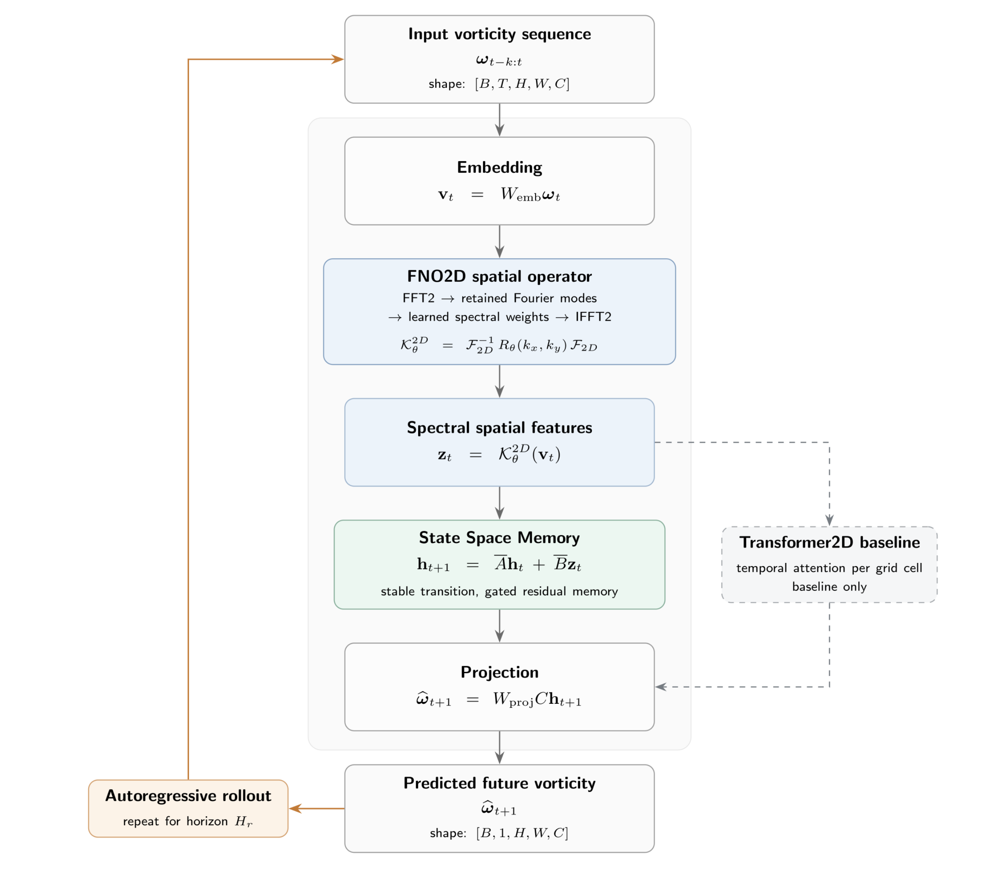

# Can We Forecast Long-Horizon PDE Dynamics Without Attention? Combining Fourier Neural Operators with State Space Memory

<p align="center">
  
</p>

**Model name:** SM-FNO: Spectral Memory Fourier Neural Operator

This repository is a research-oriented PyTorch scaffold for studying attention-free long-horizon forecasting of partial differential equation (PDE) dynamics. The project is designed to evaluate whether Fourier Neural Operators (FNOs), which model spatial structure efficiently in the spectral domain, can be combined with State Space Models (SSMs), which provide temporal memory with favorable sequence scaling, to produce competitive and cost-efficient PDE forecasters.

## Research Question

Can long-horizon PDE dynamics be forecast effectively without attention by combining spectral spatial modeling with state space temporal memory?

## Core Hypothesis

The working hypothesis is that a model combining FNO-style spatial operators with SSM-style temporal memory can achieve competitive long-horizon PDE forecasting while reducing the temporal cost associated with attention-based baselines.

This repository does **not** claim that SM-FNO already outperforms any baseline. It is structured to support fair, reproducible experiments that can test the hypothesis.

## Why Attention-Free PDE Forecasting?

Long-horizon PDE forecasting often requires modeling many time steps over spatial grids. Attention-based temporal models can be expressive, but their quadratic sequence cost can become expensive as rollout horizons grow. State space sequence models offer an alternative temporal mechanism with linear scaling in sequence length, making them a promising candidate for efficient long-horizon forecasting.

## Model Idea

SM-FNO separates the modeling problem into two complementary components:

- **Fourier Neural Operator for spatial structure:** learns spatial interactions using spectral convolution over grid states.
- **State Space Model for temporal memory:** propagates temporal information across rollout steps without attention.

The current implementation focuses on simple 1D PDEs before extending to higher-dimensional settings.

## Baselines and Model Components

- **MLP baseline:** simple fully connected reference model for smoke validation.
- **FNO baseline:** spatial operator baseline without explicit SSM memory.
- **Diagonal SSM block:** simple temporal memory module used by SM-FNO.
- **Transformer baseline:** attention-based temporal baseline placeholder for future comparison work.
- **SM-FNO proposed model:** spectral spatial modeling with state space temporal memory.

## Planned PDE Tasks

- **1D Heat equation:** smooth dissipative dynamics and a low-risk first task.
- **1D Burgers equation:** nonlinear advection-diffusion dynamics.
- **2D Navier-Stokes:** later extension for more demanding spatiotemporal dynamics.

## Planned Metrics

- Relative L2 error
- Long-horizon rollout error
- Inference time
- Memory usage
- Energy error
- Fourier spectrum error

## Repository Structure

```text
configs/          Plain YAML configs for data, models, training, and experiments.
docs/             Research notes, protocol documents, and release checklist.
scripts/          Command-line entry points for data generation, training, evaluation, and plots.
src/sm_fno/       Python package containing data, models, training, evaluation, visualization, and utilities.
tests/            Import, metric, and shape tests for early regression coverage.
data/             Local data directory. Large files are ignored by git.
outputs/          Local run outputs. Generated files are ignored by git.
results/          Local figures, tables, and checkpoints. Generated files are ignored by git.
```

## Quickstart

Create an environment with Python 3.11 or newer:

```bash
python3 -m venv .venv
source .venv/bin/activate
pip install -e ".[dev]"
```

Run the smoke-test entry point:

```bash
python3 scripts/run_smoke_test.py --config configs/experiment/smoke_test.yaml
```

Run tests:

```bash
pytest
```

Run the minimal Heat1D smoke pipelines:

```bash
PYTHONPATH=src python3 scripts/generate_data.py --config configs/data/heat1d.yaml
PYTHONPATH=src python3 scripts/train.py --config configs/experiment/heat1d_mlp_smoke.yaml
PYTHONPATH=src python3 scripts/evaluate.py --config configs/experiment/heat1d_mlp_smoke.yaml
PYTHONPATH=src python3 scripts/plot_results.py --config configs/experiment/heat1d_mlp_smoke.yaml
PYTHONPATH=src python3 scripts/train.py --config configs/experiment/heat1d_fno_smoke.yaml
PYTHONPATH=src python3 scripts/evaluate.py --config configs/experiment/heat1d_fno_smoke.yaml
PYTHONPATH=src python3 scripts/plot_results.py --config configs/experiment/heat1d_fno_smoke.yaml
PYTHONPATH=src python3 scripts/train.py --config configs/experiment/heat1d_sm_fno_smoke.yaml
PYTHONPATH=src python3 scripts/evaluate.py --config configs/experiment/heat1d_sm_fno_smoke.yaml
PYTHONPATH=src python3 scripts/plot_results.py --config configs/experiment/heat1d_sm_fno_smoke.yaml
PYTHONPATH=src python3 scripts/train.py --config configs/experiment/heat1d_transformer_smoke.yaml
PYTHONPATH=src python3 scripts/evaluate.py --config configs/experiment/heat1d_transformer_smoke.yaml
PYTHONPATH=src python3 scripts/plot_results.py --config configs/experiment/heat1d_transformer_smoke.yaml
```

## Current Status

This repository includes Heat1D and Burgers1D smoke pipelines for FNO1D, SM-FNO, and Transformer1D models, plus a Heat1D MLP smoke baseline. The current MVP supports config-driven data generation, training, evaluation, plotting, basic autoregressive rollout metrics, per-timestep rollout relative L2, and simple inference-time logging.

M6 adds fair-comparison protocol hardening: shared Heat1D protocol documentation, repeated-seed execution, metric aggregation, generated protocol summaries, and rollout-20 protocol-validation configs.

M7 adds a small CPU-friendly Transformer1D attention baseline integrated into the same Heat1D smoke, repeated-seed, rollout, aggregation, and plotting protocol.

M8 extends the protocol to a CPU-friendly viscous Burgers1D generator with FNO, SM-FNO, and Transformer smoke and rollout-20 configs.

M9 adds protocol-scale cost-efficiency analysis tooling: parameter-count logging, normalized rollout timing, config-driven horizon sweeps, cost metric aggregation, generated cost-efficiency plots, and generated analysis reports for small Heat1D and Burgers1D runs.

M10 extends the protocol to small 2D periodic Navier-Stokes vorticity forecasting with FNO2D, SM-FNO2D, and Transformer2D smoke, rollout, repeated-seed, aggregation, and horizon-sweep wiring.

M11 hardens the Navier-Stokes2D path with a small-grid FNO2D spectral-mode fix, a separate stabilized SM-FNO2D v2 model/config path, and protocol-scale v2 smoke, rollout, repeated-seed, aggregation, and cost-efficiency reporting.

M12 adds forum wrap-up materials: a 15 minute talk outline, student section assignments, technical Q&A, figure-selection guide, final forum report draft, and final results caveats. These documents reference generated artifact paths for presentation preparation without adding generated outputs to git or making benchmark claims.

The current smoke and repeated-seed runs are pipeline checks only. Larger datasets, stronger baselines, numerical validation, and final fair-comparison reports remain future work.

## Public Release Note

Formal results are not yet available. Do not cite performance claims from this repository until reproducible experiments, baseline comparisons, and metrics are published.

## Citation

A formal citation will be added after public release. For now, see [CITATION.cff](CITATION.cff) for placeholder metadata.

## License

This project is planned for release under the MIT License. See [LICENSE](LICENSE).
